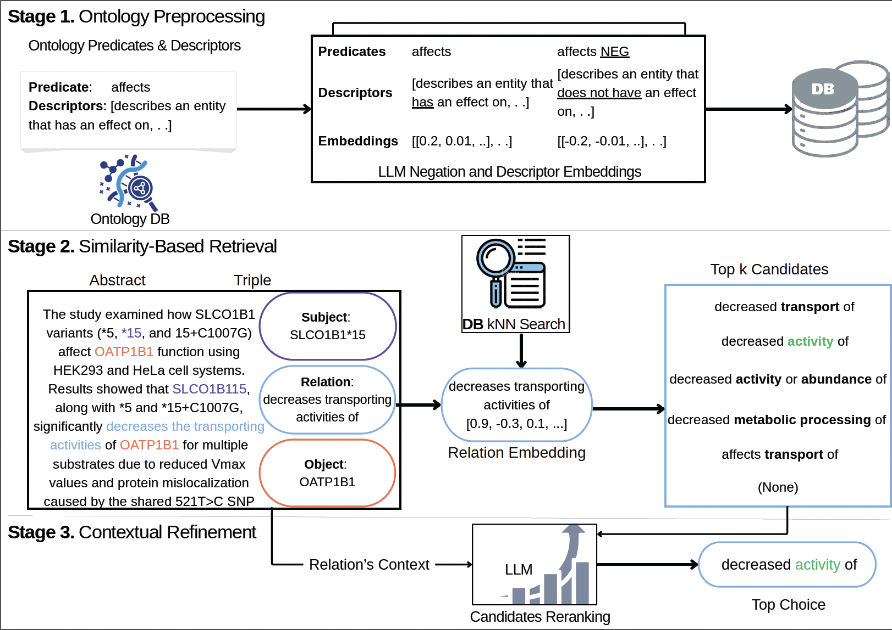

# RELATE — Predicate Annotation

> **Paper:** [RELATE: Relation Extraction in Biomedical Abstracts with LLMs and Ontology Constraints](https://arxiv.org/abs/2509.19057)
> Olawumi Olasunkanmi, Matthew Satusky, Hong Yi, Chris Bizon, Harlin Lee, Stanley Ahalt
> *UNC Chapel Hill & RENCI* | Funded by NIH LitCoin (#75N95023C00032)

## The Problem

Biomedical knowledge graphs (KGs) like [ROBOKOP](https://robokop.renci.org/) are vital for drug discovery and clinical decision support, but they remain incomplete. Unstructured biomedical text — millions of PubMed abstracts — is a vast, underutilized source that could fill these gaps.

Large language models can extract relationships from text (e.g., *"metformin treats type 2 diabetes"*), but their outputs are free-form strings that don't conform to standardized ontologies. A KG built on the [Biolink Model](https://biolink.github.io/biolink-model/) needs predicates like `biolink:treats`, not arbitrary phrases like "is used to treat" or "has therapeutic effect on." Mapping free-text relations to ontology predicates is hard because of:

- **Semantic ambiguity** — "decreases transporting activities of" could map to `biolink:affects`, `biolink:decreases_transport_of`, or several others
- **Negation** — "does not affect" and "fails to treat" require detecting negative assertions, not just matching surface text
- **Domain jargon** — abbreviations, indirect phrasing, and contextual nuance that only make sense within the abstract
- **Scale of the ontology** — Biolink defines 284 predicates; selecting the right one from that space is beyond simple keyword matching

## The RELATE Pipeline

The core aim is to **map free-text phrasal relations extracted by LLMs to standardized ontology predicates.** An LLM might extract *"decreases transporting activities of"* from an abstract — RELATE maps that to the Biolink predicate `biolink:decreased_activity_of`.


*The three-stage RELATE pipeline: (1) ontology preprocessing, (2) similarity-based retrieval, (3) contextual refinement.*

**Stage 1 — Ontology Preprocessing:** Collects all Biolink predicates with their textual descriptors (e.g., *affects* → *"describes an entity that has an effect on..."*), generates negated variants using an LLM (*affects NEG* → *"describes an entity that does not have an effect on..."*), and embeds everything into a searchable vector database. This runs once and only updates when the ontology or embedding model changes.

**Stage 2 — Similarity-Based Retrieval:** Given an extracted quadruple — subject, object, free-text relation, and abstract context — the relation text is embedded and compared against the predicate database via kNN search. This retrieves the top-*k* (typically 10) candidate predicates ranked by cosine similarity. For example, *"decreases transporting activities of"* retrieves candidates like *decreased transport of*, *decreased activity of*, *decreased activity or abundance of*, and a *None* option.

**Stage 3 — Contextual Refinement:** An LLM reranks the candidates using the full relation context — the subject, object, relation text, and surrounding abstract. It selects the single best predicate, detects negation (e.g., *"does not affect"* → `affects` with negated=True), or rejects the relation entirely if it's not a valid biomedical association (e.g., methodological statements like *"Anisomycin used to detect GNPTG"*).

## Why a Controlled Corpus Is Needed

RELATE achieves 52% exact match on ChemProt and 94% accuracy@10, but the HEAL Project abstracts (2,400 real-world opioid research papers) have **no ground truth**. Unlike curated benchmarks, real biomedical literature contains:

- Methodological statements (*"Anisomycin used to detect GNPTG"*) that look like biomedical relations but aren't
- Negative findings (*"drug does not affect condition"*) that must be flagged, not mapped as positive assertions
- Nuanced relationships where the correct Biolink predicate is debatable even among domain experts

To validate RELATE's outputs and build a reliable KG, **human expert annotation is essential.** This annotation platform recruits HEAL abstract authors and domain experts to systematically evaluate the quality of RELATE's predicate mappings — verifying whether the automated pipeline chose the right predicate, or correcting it when it didn't.

The resulting controlled corpus serves as:
1. **Ground truth** for evaluating and improving RELATE's accuracy on real-world data
2. **Training signal** for future model improvements
3. **Quality-assured input** for integration into ROBOKOP, ensuring only validated facts enter the KG

## Features

- Entity highlighting: subject (blue), object (red), relationship context (yellow)
- Smart predicate search with LLM suggestion prioritization
- Keyboard shortcuts: `Space` skip, `F` flag, `← →` navigate triples
- Auto-advance after annotation with progress tracking, streaks, and achievements
- Multi-annotator support with article assignment system
- Skip/flag triples for later review

## Annotator Workflow

1. Go to `/relate-triples` and log in with your first and last name
2. The interface shows only articles assigned to you
3. For each triple, read the abstract with highlighted entities, then select the correct Biolink predicate from the searchable dropdown
4. Auto-advances to the next triple; completion modal at end of each article
5. Review skipped/flagged items via the header buttons

## Loading Data

```bash
cd backend

# From a local JSON file
python load_corpus.py /path/to/corpus.json
```

### Corpus Format (JSON)
```json
[
  {
    "pmid": "12345678",
    "title": "Article Title",
    "abstract": "Article abstract text...",
    "year": 2024,
    "triples": [
      {
        "subject": "gene name",
        "subject_id": "HGNC:12345",
        "subject_types": ["biolink:Gene"],
        "subject_start": 10,
        "subject_end": 20,
        "object": "disease name",
        "object_id": "MONDO:0001",
        "object_types": ["biolink:Disease"],
        "object_start": 50,
        "object_end": 65,
        "relationship": "associated with"
      }
    ]
  }
]
```

## Database Tables

| Table | Purpose |
|-------|---------|
| `articles` | PubMed articles (PMID, title, abstract, year, keywords) |
| `entities` | Extracted entities (text, CURIEs, Biolink types, positions) |
| `triples` | Entity pairs to annotate (subject, object, LLM suggestion) |
| `annotations` | Saved annotations (predicate, confidence, notes, flags) |
| `annotator_stats` | Streaks, achievements, annotation counts |
| `article_assignments` | Article-to-annotator mapping with completion tracking |
